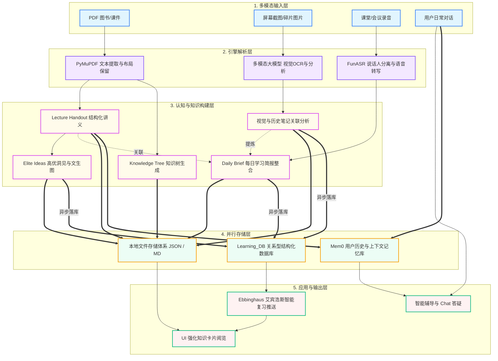

针对你当前的整个教育辅助应用系统（oppo_edu_app），我为你梳理了系统全局的**处理流程描述**，并配套提供了**逻辑流程图**和**数据流程图**。

### 一、 系统处理流程描述

整个系统的核心定位是一个**多模态的智能教育与知识管理平台**。它的处理流自底向上可以划分为：**输入层 → 解析层 → 认知构建层 → 存储层 → 应用层**。

#### 1. 逻辑处理流程 (Logical Flow)
*   **多模态接入**：系统支持多种学习资料的碎片化或系统化输入，包括结构化的文档（PDF）、碎片化的视觉信息（屏幕截图）、以及线下的音频场景（会议录音/课堂语音），同时支持用户的日常对话（Chat）。
*   **引擎解析**：
    *   PDF文件通过 `PyMuPDF (fitz)` 引擎被快速或结构化地解析为携带页码、章节信息的纯文本。
    *   音频文件被发送至 Windows 端的本地 GPU `FunASR` 服务，转写为带有说话人标签和时间戳的文本。
    *   图片截图通过多模态大模型的视觉能力，进行全量信息抽取（OCR、版面分析）。
*   **认知与结构构建（核心链路）**：这是系统的大脑。
    *   **讲义与知识树生成**：基于 PDF 解析的文本，LLM 将其浓缩结构化为带有核心概念、公式（LaTeX）的讲义（Handout），以及呈树状发散的知识树（Knowledge Tree）。
    *   **高优洞见提取**：在讲义基础上，提取超越学科的“元想法”（Elite Ideas），配合智增增的文生图能力为抽象洞见生成配图。
    *   **跨模态知识关联**：将刚识别出来的截图信息，与历史存储的知识卡片进行“原理性关联”，并补充进每日简报。
    *   **每日简报聚合**：将当天的学习轨迹、生成卡片、录音转写等内容统一聚合成 Daily Briefing。
*   **降级与旁路存储**：所有高价值产物采用**混合存储策略**——首先落盘为本地的结构化 JSON / Markdown文件，其次将结构化字段通过 HTTP API 异步“best-effort（尽力而为）”的方式写入后端关系型数据库 `Learning_DB` 中（保证前台接口的无感与高可用）；同时，相关的用户偏好和事实性记忆被喂入 `Mem0` 向量记忆库。
*   **应用触达**：基于沉淀的数据，在应用端形成前端知识卡片流、艾宾浩斯（Ebbinghaus）遗忘曲线的复习推送、以及基于历史记忆的智能对答。

#### 2. 数据处理流程 (Data Flow)
数据的生命周期经历了 **Raw Data (非结构化) -> Extracted Text (半结构化) -> LLM JSON Object (强结构化) -> Database / Index (持久化)** 的转变。
*   **输入流**：以二进制（`bytes` / `base64` / `wav`）形态流入业务主从服务。
*   **清洗流**：PDF 滤掉空白和乱码；Image 根据大小被压缩；Text 被截断以防越出 LLM Token 限制（如前 40000 字符）。
*   **结构化流**：LLM 强制配置 `response_format={"type": "json_object"}`，促使游离文本转化为具备 Schema 的 JSON 实体（包含 `title, summary, cases, relatedNodeId` 等）。
*   **持久化流**：JSON 被分配 ID，双线并行：
    *   **路线 1（磁盘）**：handouts, elite_ideas, processed_notes。
    *   **路线 2（DB API）**：通过主服务的后台任务（BackgroundTasks），将字段严格对齐后发起 `POST /api/v1/elite-idea-cards` 等请求，并配合本地 `persist_index.json` 完成数据库幂等落库，避免重复插入。

---

### 二、 逻辑流程图 (Logical Flowchart)

该图展示了系统的业务层级流转及模块间的职责边界规则。



---

### 三、 数据流程图 (Data Flow Diagram / DFD)

该图重点展示了数据在系统内部的形态转换（如：流 -> 文本 -> JSON -> 关系型表）以及系统的异步/幂等落盘机制。

```mermaid
flowchart LR
    subgraph Raw Source
        DS_PDF(PDF Stream)
        DS_Pic(Base64 Image)
        DS_Wav(Audio Bytes)
    end

    subgraph Service Processors
        P_PyMuPDF(fitz.open / get_text)
        P_FunASR[FastAPI ASR endpoint\nWindows GPU]
        P_LLM{LLM Response\nJSON Object format}
        P_Idempotent(应用层幂等控制器\nHash Indexing)
    end

    subgraph Persisted Entities
        E_Files[(data/ directory\nJSON & Images)]
        E_Mem0[(Mem0 API\nVector & Context)]
        E_DB[(Learning_DB MySQL\nelite_cards/cases...)]
    end

    %% 数据从源头提取
    DS_PDF -- File Path/Bytes --> P_PyMuPDF
    DS_Pic -- base64 --> P_LLM
    DS_Wav -- POST multipart/form-data --> P_FunASR

    P_PyMuPDF -- 截断清洗后的 Text --> P_LLM
    P_FunASR -- raw_transcript/minutes --> P_LLM
    
    %% LLM生成结构化JSON
    P_LLM -- Handout dict --> E_Files
    P_LLM -- Elite Idea dict --> E_Files
    P_LLM -- Screenshot matched dict --> E_Files
    
    %% 生成落库与记忆
    P_LLM -- user_id, context --> E_Mem0

    %% 异步落库机制（重点路径）
    E_Files -- bg_generate_xxx 后台任务读取 --> P_Idempotent
    P_Idempotent -- "未处理过或状态失败" --> DB_Write[HTTP REST Client]
    P_Idempotent -- "已处理 (status: done)\n拒绝插入" -.- x1[Skip]
    DB_Write -- POST /api/v1/... --> E_DB
    E_DB -- 外键回填响应 (id) --> P_Idempotent
    P_Idempotent -- 更新状态/ID Map --> E_Files

    %% 样式
    classDef raw fill:#f1f5f9,stroke:#64748b,stroke-width:2px;
    classDef processor fill:#e0f2fe,stroke:#0ea5e9,stroke-width:2px,stroke-dasharray: 5 5;
    classDef dest fill:#fef3c7,stroke:#f59e0b,stroke-width:2px;

    class DS_PDF,DS_Pic,DS_Wav raw;
    class P_PyMuPDF,P_FunASR,P_LLM,P_Idempotent,DB_Write processor;
    class E_Files,E_DB,E_Mem0 dest;
```