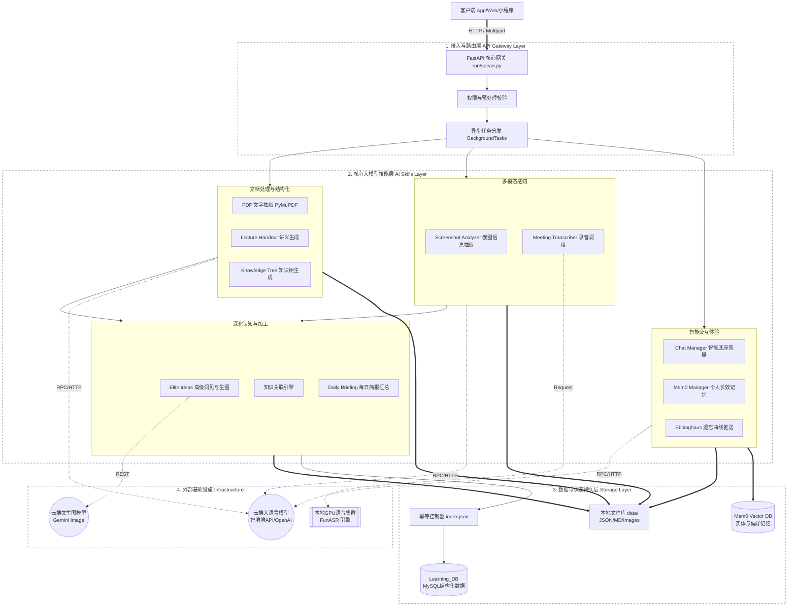

针对整个教育辅助应用系统（`oppo_edu_app`），系统的整体架构采用了**分层设计（Layered Architecture）**与**模块化驱动（Modular Design）**相结合的思想。为了保证核心主流程的响应速度，系统大量使用了异步任务（BackgroundTasks）来解耦“前台响应”与“后台重计算/重存储”的操作。

下面是系统的**模块架构图**及其详细的**层级与模块描述**。

---

### 一、 模块架构图 (Module Architecture Diagram)

---

### 二、 架构层级与核心模块描述

整个系统由上至下严格分为四大层，各层职责单一，通过内部函数调用或轻量级 HTTP 进行通信。

#### 1. 接入与路由层 (API Gateway Layer)
此层是系统对外的唯一出入口，基于高并发框架 **FastAPI** (server.py) 搭建。
*   **API 路由网关 (Router)**：对外暴露标准的 RESTful 接口（如 `/upload_pdf`, `/chat`, `/extract_elite_ideas` 等），负责接收移动端或Web端的文件流（Multipart）和 JSON 载荷。
*   **异步任务调度 (BackgroundTasks)**：核心机制。由于 LLM 推理、文生图和语音识别属于重度耗时操作，路由层会快速返回 200/204 或基础结构，将复杂的入库、关联分析、长文本生成操作推入后台守护线程执行，防止阻塞客户端。

#### 2. 核心大模型技能层 (AI Skills Layer)
这部分是系统的“中央处理器”，集成了所有的智能化业务逻辑，存放在项目的 skill 目录下。依据功能划分为四个子模块：
*   **文档处理与结构化模块**：
    *   **PDF 解析 (`pdf_processor.py`)**：使用 `PyMuPDF` 引擎粗扫或精扫 PDF，解决文本乱码和页码标记问题。
    *   **讲义引擎 (`lecture_handout_generator.py`)**：通过高写成的 Prompt 约束模型强制输出严格的 JSON Schema，将散乱的文本合并成含“章节、核心概念、LaTeX公式”的规范讲义。
    *   **知识树引擎 (`knowledge_tree_generator.py`)**：采用“分步摘要-再展开”的 Tree-of-Thought 思路，构建具有层级结构（Parent-Child）和非线性交叉引用（relatedNodeId）的知识图谱。
*   **多模态感知模块**：
    *   **视觉抽取 (`screenshot_analyzer.py`)**：处理由于上课拍黑板、网页截图带来的碎片化图文。除了识别 OCR 文字，更重要是识别排版布局、表格、代码块，并执行与该用户以往笔记的关联打分。
    *   **语音调度 (`meeting_transcriber.py`)**：负责充当音频处理的调度员，将巨大的音频流发送至远端或本机的 GPU ASR 服务器处理。
*   **深化认知与加工模块**：
    *   **高级洞见 (`elite_ideas_extractor.py`)**：从讲义中榨取超脱于学科本身的“Meta Ideas（元思考）”，并联动文生图接口（Gemini）自动生成抽象的知识卡片插图。
    *   **简报聚合 (`daily_briefing_generator.py`)**：收集用户今日的所有的产生（截图笔记、录音纪要、生成讲义），撰写成系统化的每日简报。
*   **智能交互体验模块**：
    *   **智能对话 (`chat_manager.py`)**：负责处理前台的用户 QA，自带上下文组装逻辑。
    *   **复习引擎 (`ebbinghaus_recommender.py`)**：结合艾宾浩斯记忆曲线算法，从持久层抓取到期需要复习的知识卡片进行反向推送。

#### 3. 数据与状态持久层 (Storage Layer)
系统采用了“本地文件系统为主，关系型DB为辅，向量库增强”的混合数据架构：
*   **本地 JSON/MD 库 (data)**：最高信任度的数据源。所有的生成结果（卡片、讲义、音频纪要）以 JSON/Markdown 形式硬存在本地对应目录下。兼具低成本和高扩展度，方便离线迁移与纠错。
*   **关系型数据库 (`Learning_DB`)**：使用 MySQL 与独立的 FastAPI 暴露 CRUD 端点。存储高度结构化的核心价值数据（如 Elite Ideas Cards / Cases），以支持复杂的SQL查询、连表检索及数据大屏应用。
*   **应用层幂等机制 (`index.json`)**：不侵入数据库改表，在主服务侧通过归一化计算 Payload 的稳定 Hash 值作为入库凭证。确保一份通过后台重试的成果物**只被持久化进数据库一次**。
*   **记忆与向量库 (`Mem0`)**：使用 Mem0 系统存储跨越 Session 的长期记忆（用户的学习偏好、事实片段），在后续的 Chat 回话中通过向量相似度召回作为上下文。

#### 4. 外部基础设施 (Infrastructure)
为 AI 技能层提供算力的底座：
*   **云端 LLM 服务**：对接类似 智增增/OpenAI 兼容的 API 实现推理与文字重构。
*   **云端 T2I (Text-to-Image)**：对接 Gemini API 实现抽象知识概念的配图。
*   **本地 GPU 集群 (FunASR)**：部署在 Windows RTX 节点上的独立语音解析微服务，利用 `paraformer-zh(主识别)`、`fsmn-vad(静音检测)`、`cam++(说话人分类)` 模型群实现纯本地、零隐私泄漏的会议转写。