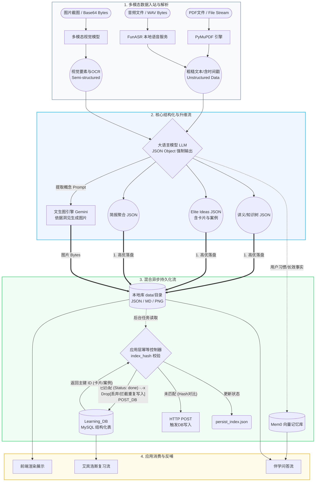

这是针对 `oppo_edu_app` 系统的**数据流转设计**部分。系统的核心价值在于“点石成金”，即把散乱的、非结构化的异构数据，沉淀为高度结构化、可被机器与人双向查询的高价值知识。整体数据流转遵循 **“采集入站 -> 解析清洗 -> 结构化重塑 -> 异步幂等持久化 -> 应用消费”** 的全生命周期。

下面是系统的数据流转流程图及详细描述。

---

### 一、 数据流转流程图 (Data Flow Diagram)

该图展示了数据在系统内部的形态演变（从流数据、到粗糙文本、到JSON、再到数据库记录）以及落库的双线并行机制。

---

### 二、 数据流转阶段详细描述

通过观察数据流转图，整个系统的数据流动可拆解为四大关键阶段：

#### 阶段一：多模态数据入站与解析 (Data Ingestion & Parsing)
这是数据“脱壳”的过程。系统暴露的 API 接收到前端传来的二进制文件流或 Base64 编码，进入各种专用的解析引擎：
*   **PDF 流转**：由字节流经 `PyMuPDF` 处理为纯字符流（String），去除图片与特殊排版，为防止大模型上下文超限，会做截断保护（如前 40000 字符）。
*   **音频流转**：WAV 字节流通过 HTTP Multipart 被投递给本机 GPU 上的 `FunASR` 服务，返回的结果不仅有识别文本，还附带了“说话人 ID”与“句级时间戳”，形成半结构化的转储数据。
*   **图片流转**：直接对 Base64 数据进行多模态视觉理解，产出含有 OCR 文本、页面布局位置（Top-left 等）的中间态初步要素数据。

#### 阶段二：核心结构化与升维流 (Cognitive Structuring & Up-scaling)
这是数据发生质变的环节（**Unstructured -> Highly Structured**），数据清洗后进入 LLM。
*   **强制结构化映射**：通过 `response_format={"type": "json_object"}` 这一硬性约束，原本游离的自然语言文本，被模型填入预先确定的 JSON Schema（例如包含 `meta`, `overview`, `sections`, `key_concepts` 等固定键值）。
*   **关联与升维衍生物**：在生成主干的同时，数据产生分流。文字侧产出 Elite Ideas（卡片和案例）；为了具象化表达，这些文本概念通过提示词工厂组装后，流向 `Gemini T2I` 引擎，返回的图片 Bytes 会与文字数据绑定（`imagePath` 字段）。

#### 阶段三：混合异步持久化流 (Hybrid Async Persistence) — **关键设计**
为了不让繁重的 IO 和网络请求阻塞前端，并处理复杂的数据库写入，数据在这里发生了并行的“主旁路存储”：
*   **主干极速落盘 (Local Storage)**：大模型吐出的 JSON 和 文生图产生的图像二进制文件，第一时间以毫秒级速度被写入 data 本地工作区（如 `_handout.json`, `_elite_ideas_db.json`），构成了系统的“单点真实数据源 (Single Source of Truth)”。
*   **后台异步幂等落库 (Idempotent DB Insertion)**：
    *   文件落盘后，触发主服务的 `BackgroundTasks`（后台任务）。
    *   后台程序读取这个 JSON 文件，将其内容**归一化计算出一串哈希值（Hash）**，作为判断凭证送入**应用层幂等控制器**（一个本地的 `persist_index.json` 文件库）。
    *   如果该 Hash 尚未落库（未处理），主服务才会组装成严格契合数据库 ORM 列的载荷，向 `Learning_DB` 发起 HTTP POST 请求。
    *   数据库执行由主及次的“外键回填插入”（先插 Cards 拿到主键 ID，再用 ID 插入 Cases 和 Resources）。插入成功后，将状态标为 `status: done`。这一机制完美保证了**同一个学习产物即使被重试一百次，也绝对只会入库一次**，不搞脏数据库。
*   **向量记忆分化**：涉及用户个人历史、习惯性偏好的上下文数据，则被向量化并流入 `Mem0` API。

#### 阶段四：应用消费与反哺 (Application Consumption & Feedback)
数据最终在表现层被各类业务逻辑唤醒：
*   前端直接请求服务器读取本地的 MD 或者 JSON 文件进行卡片流与排版渲染。
*   艾宾浩斯引擎定期运行 SQL，从 `Learning_DB` 中基于 `created_at` 和复习历史捞取数据行，组装成推送数据推给应用层。
*   用户进行 Chat 提问时，系统会先通过用户的输入的意图，从 `Mem0` 和本地 data 目录中相似检索曾经的讲义数据，拼入 Prompt 后发给大模型，促成有记忆的、高度相关的伴学问答。